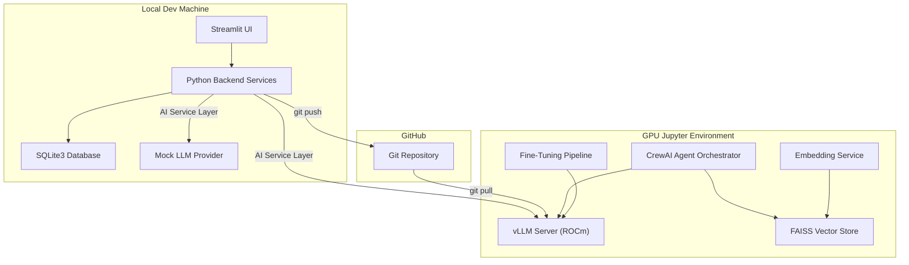
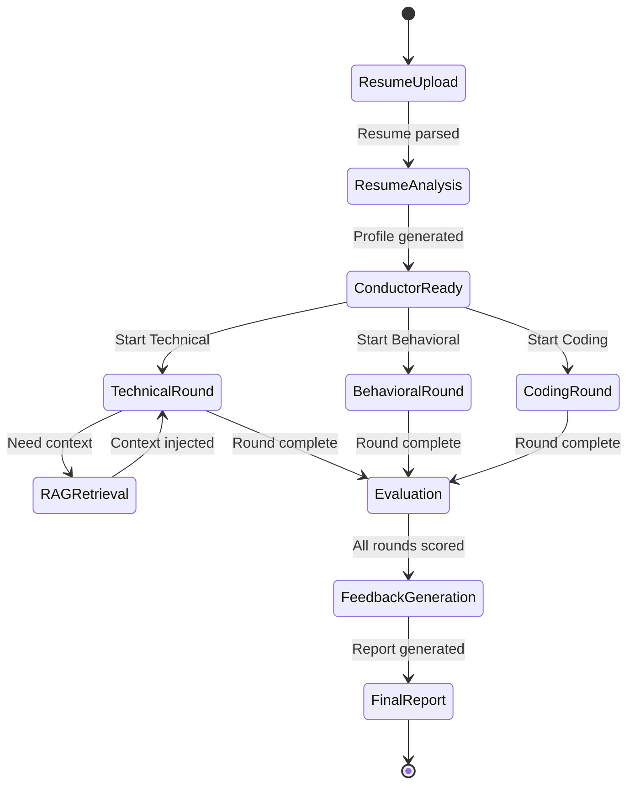

# AI Interviewer Agent System — Implementation Plan

## Overview

Build a **hackathon-winning AI Interviewer Agent Platform** for the TCS AI Hackathon that conducts technical, behavioral, and coding interviews using multi-agent orchestration, RAG pipelines, fine-tuned LLMs, and GPU-accelerated inference — all running across a **local dev environment** (no GPU) and a **Jupyter GPU environment** (ROCm + vLLM).

---

## High-Level Architecture



### Key Architecture Principle: The AI Service Layer

All LLM/AI calls go through an **abstract `ModelProvider` interface**. Two implementations exist:

| Provider | Environment | Purpose |
|----------|-------------|---------|
| `MockProvider` | Local dev | Returns canned/template responses, no GPU needed |
| `VLLMProvider` | Jupyter GPU | Connects to local vLLM server for real inference |
| `OpenAICompatibleProvider` | Either | Connects to any OpenAI-compatible API endpoint |

This means the **entire Streamlit app runs locally** with mock responses for rapid UI development, then switches to real inference in the GPU environment by changing a single config value.

---

## User Review Required

> [!IMPORTANT]
> **Model Selection**: The plan defaults to **Qwen2.5-7B-Instruct** as the primary model (good balance of quality vs. VRAM). If your GPU has ≥48GB VRAM, we can use Llama 3.1 70B (quantized). Please confirm your GPU model and VRAM.

> [!IMPORTANT]
> **CrewAI vs. Custom Orchestration**: The plan uses **CrewAI** for multi-agent orchestration (mature, well-documented). An alternative is a custom lightweight orchestrator using LangChain agents. CrewAI adds a dependency but provides agent-to-agent delegation, memory sharing, and structured task flows out of the box. Do you have a preference?

> [!WARNING]
> **Fine-Tuning Scope**: Full fine-tuning pipeline (dataset generation → QLoRA training → evaluation → export) is included but will only execute in the Jupyter GPU environment. The local app includes the dataset generation scripts and config, but training must happen on GPU. Is this acceptable?

---

## Open Questions

1. **GPU Hardware**: What AMD GPU model and VRAM do you have in the Jupyter environment? This determines model size, quantization strategy, and batch sizes.
2. **Interview Domain Focus**: Should the system focus on specific tech stacks (e.g., React, Node.js, Python, System Design) or be fully general-purpose?
3. **Hackathon Timeline**: How many days do you have? This affects whether we prioritize breadth (all features at demo level) or depth (fewer features, production-quality).
4. **Resume Format Priority**: Should we invest in OCR for scanned resumes, or is PDF/DOCX text extraction sufficient?
5. **ChromaDB vs FAISS**: FAISS is faster and GPU-acceleratable but requires manual persistence. ChromaDB is simpler with built-in persistence. The plan uses **FAISS** for hackathon impact. Confirm?

---

## Proposed Changes

### Phase 1: Project Foundation & Database

#### [NEW] Project Structure

```
d:\AI Hackathon\
├── app/
│   ├── __init__.py
│   ├── main.py                    # Streamlit entry point
│   ├── config.py                  # Central configuration
│   ├── agents/
│   │   ├── __init__.py
│   │   ├── base_agent.py          # Abstract base agent
│   │   ├── conductor.py           # Interview Conductor Agent
│   │   ├── technical.py           # Technical Interview Agent
│   │   ├── behavioral.py          # HR Behavioral Agent
│   │   ├── resume_analyzer.py     # Resume Analyzer Agent
│   │   ├── rag_agent.py           # RAG Retrieval Agent
│   │   ├── coding.py              # Coding Assessment Agent
│   │   ├── evaluator.py           # Evaluation Agent
│   │   └── feedback.py            # Feedback Agent
│   ├── rag/
│   │   ├── __init__.py
│   │   ├── embeddings.py          # Embedding pipeline
│   │   ├── vector_store.py        # FAISS vector store
│   │   ├── chunking.py            # Document chunking strategies
│   │   ├── retriever.py           # Hybrid retrieval (dense + sparse)
│   │   └── knowledge_base.py      # Interview knowledge management
│   ├── database/
│   │   ├── __init__.py
│   │   ├── schema.py              # SQLite schema definitions
│   │   ├── models.py              # Data models (dataclasses)
│   │   ├── crud.py                # CRUD operations
│   │   └── connection.py          # DB connection manager
│   ├── models/
│   │   ├── __init__.py
│   │   ├── provider.py            # Abstract ModelProvider interface
│   │   ├── mock_provider.py       # Mock provider (local dev)
│   │   ├── vllm_provider.py       # vLLM provider (GPU)
│   │   └── openai_provider.py     # OpenAI-compatible provider
│   ├── memory/
│   │   ├── __init__.py
│   │   ├── conversation.py        # Conversation memory
│   │   ├── agent_memory.py        # Shared agent memory
│   │   └── session.py             # Interview session state
│   ├── evaluation/
│   │   ├── __init__.py
│   │   ├── scoring.py             # Answer scoring engine
│   │   ├── rubric.py              # Evaluation rubrics
│   │   └── report.py              # Report generation
│   ├── fine_tuning/
│   │   ├── __init__.py
│   │   ├── dataset.py             # Dataset creation
│   │   ├── trainer.py             # QLoRA training pipeline
│   │   ├── evaluate.py            # Model evaluation
│   │   └── export.py              # Model export
│   ├── services/
│   │   ├── __init__.py
│   │   ├── resume_parser.py       # Resume upload & parsing
│   │   ├── interview_service.py   # Interview orchestration
│   │   ├── question_service.py    # Question generation
│   │   └── ai_service.py          # Central AI service layer
│   ├── prompts/
│   │   ├── __init__.py
│   │   ├── templates.py           # All prompt templates
│   │   ├── system_prompts.py      # Agent system prompts
│   │   └── evaluation_prompts.py  # Evaluation prompt templates
│   ├── ui/
│   │   ├── __init__.py
│   │   ├── pages/
│   │   │   ├── dashboard.py       # Main dashboard page
│   │   │   ├── resume_upload.py   # Resume upload page
│   │   │   ├── interview.py       # Interview session page
│   │   │   ├── evaluation.py      # Results & evaluation page
│   │   │   ├── coding.py          # Coding assessment page
│   │   │   └── settings.py        # Settings page
│   │   ├── components/
│   │   │   ├── sidebar.py         # Sidebar navigation
│   │   │   ├── chat.py            # Chat interface component
│   │   │   ├── metrics.py         # Metric cards
│   │   │   ├── resume_card.py     # Resume display card
│   │   │   └── code_editor.py     # Code editor component
│   │   └── styles/
│   │       └── theme.py           # Streamlit theme & CSS
│   ├── utils/
│   │   ├── __init__.py
│   │   ├── logger.py              # Structured logging
│   │   ├── helpers.py             # Utility functions
│   │   └── validators.py          # Input validation
│   └── notebooks/
│       ├── 01_gpu_setup.ipynb          # GPU validation
│       ├── 02_vllm_serving.ipynb       # vLLM model serving
│       ├── 03_embedding_generation.ipynb  # Embedding pipeline
│       ├── 04_fine_tuning.ipynb        # Fine-tuning pipeline
│       └── 05_full_pipeline.ipynb      # End-to-end demo
├── data/
│   ├── knowledge_base/            # Interview knowledge docs
│   ├── sample_resumes/            # Test resumes
│   └── fine_tuning/               # Training datasets
├── .streamlit/
│   └── config.toml                # Streamlit theme config
├── .env.example                   # Environment variables template
├── requirements.txt               # Core dependencies
├── requirements-gpu.txt           # GPU-specific dependencies
├── Dockerfile                     # Docker setup
├── docker-compose.yml             # Docker compose
├── Makefile                       # Common commands
└── README.md                     # Project documentation
```

---

#### [NEW] [schema.py](file:///d:/AI Hackathon/app/database/schema.py)

SQLite schema covering all 9 required tables:

- `resumes` — candidate info, parsed content, upload metadata
- `interview_sessions` — session state, type, agent assignments
- `questions` — generated questions with difficulty, category, source agent
- `answers` — candidate responses with timestamps
- `evaluations` — per-answer scoring with rubric breakdown
- `coding_submissions` — code, language, test results, complexity analysis
- `embeddings_metadata` — vector store references, chunk info
- `feedback_reports` — final reports with strengths/weaknesses/recommendations
- `agent_logs` — full agent activity audit trail

---

#### [NEW] [config.py](file:///d:/AI Hackathon/app/config.py)

Central configuration using `pydantic-settings`:

```python
class Settings:
    # Environment: "local" | "gpu"
    ENVIRONMENT: str = "local"
    
    # Model provider: "mock" | "vllm" | "openai"
    MODEL_PROVIDER: str = "mock"
    
    # vLLM settings (GPU environment)
    VLLM_BASE_URL: str = "http://localhost:8000/v1"
    VLLM_MODEL: str = "Qwen/Qwen2.5-7B-Instruct"
    
    # Embedding model
    EMBEDDING_MODEL: str = "BAAI/bge-base-en-v1.5"
    
    # Database
    DATABASE_PATH: str = "data/interviews.db"
    
    # FAISS
    FAISS_INDEX_PATH: str = "data/faiss_index"
```

---

### Phase 2: AI Service Layer & Model Providers

#### [NEW] [provider.py](file:///d:/AI Hackathon/app/models/provider.py)

Abstract `ModelProvider` protocol:

```python
class ModelProvider(Protocol):
    async def generate(self, prompt: str, system_prompt: str, **kwargs) -> str: ...
    async def generate_structured(self, prompt: str, schema: Type[BaseModel], **kwargs) -> BaseModel: ...
    async def stream(self, prompt: str, system_prompt: str, **kwargs) -> AsyncIterator[str]: ...
    def get_model_info(self) -> dict: ...
```

#### [NEW] [mock_provider.py](file:///d:/AI Hackathon/app/models/mock_provider.py)

Mock implementation that returns realistic template responses for each agent type. Enables full UI/UX development without GPU.

#### [NEW] [vllm_provider.py](file:///d:/AI Hackathon/app/models/vllm_provider.py)

Production provider connecting to local vLLM server via OpenAI-compatible API:
- Streaming support
- Structured JSON output
- Temperature/top-p control
- Token usage tracking

#### [NEW] [ai_service.py](file:///d:/AI Hackathon/app/services/ai_service.py)

Singleton service that wraps the active provider, adds:
- Retry logic with exponential backoff
- Token budget management
- Response caching
- Structured output parsing
- Guardrails (content filtering, hallucination checks)

---

### Phase 3: Resume Parsing & RAG Pipeline

#### [NEW] [resume_parser.py](file:///d:/AI Hackathon/app/services/resume_parser.py)

Resume processing pipeline:
1. **Ingestion**: Accept PDF/DOCX via Streamlit file uploader
2. **Text Extraction**: `PyMuPDF` for PDFs, `python-docx` for DOCX
3. **Structured Extraction**: LLM-powered extraction into Pydantic schema (skills, experience, education, projects, certifications)
4. **Storage**: Save parsed data to SQLite `resumes` table

#### [NEW] [embeddings.py](file:///d:/AI Hackathon/app/rag/embeddings.py)

Embedding pipeline using `sentence-transformers`:
- Model: `BAAI/bge-base-en-v1.5` (768-dim, excellent quality/speed ratio)
- Batch processing for efficiency
- Local mode: Pre-computed embeddings loaded from disk
- GPU mode: Real-time embedding generation

#### [NEW] [vector_store.py](file:///d:/AI Hackathon/app/rag/vector_store.py)

FAISS vector store wrapper:
- Index creation and persistence
- Add/search/delete operations
- Metadata storage alongside vectors
- GPU-accelerated search when available

#### [NEW] [chunking.py](file:///d:/AI Hackathon/app/rag/chunking.py)

Smart chunking strategies:
- Section-aware splitting for resumes
- Recursive character splitting for knowledge docs
- Overlap management for context preservation

#### [NEW] [retriever.py](file:///d:/AI Hackathon/app/rag/retriever.py)

Hybrid retriever combining:
- Dense retrieval (FAISS semantic search)
- Sparse retrieval (BM25 keyword matching via `rank_bm25`)
- Re-ranking with cross-encoder (optional, GPU environment)
- Metadata filtering (by resume section, knowledge domain)

---

### Phase 4: Multi-Agent System (CrewAI)

#### [NEW] [base_agent.py](file:///d:/AI Hackathon/app/agents/base_agent.py)

Base class wrapping CrewAI Agent with:
- Shared memory access
- Logging/audit trail
- Token tracking
- Error handling

#### [NEW] 8 Agent Implementations

Each agent file defines a CrewAI Agent with:
- **Role/Goal/Backstory** — tailored system prompts
- **Tools** — custom tools (RAG search, DB queries, code execution)
- **Tasks** — structured task definitions with expected outputs

| Agent | File | Key Capabilities |
|-------|------|-------------------|
| **Conductor** | `conductor.py` | Flow control, state machine, agent routing |
| **Technical** | `technical.py` | DSA, system design, framework-specific questions, adaptive difficulty |
| **Behavioral** | `behavioral.py` | STAR method evaluation, soft skills, leadership |
| **Resume Analyzer** | `resume_analyzer.py` | Deep resume analysis, gap detection, personalized Q generation |
| **RAG Agent** | `rag_agent.py` | Semantic search, context injection, knowledge retrieval |
| **Coding** | `coding.py` | Problem generation, solution evaluation, complexity analysis |
| **Evaluator** | `evaluator.py` | Rubric-based scoring, confidence detection, reasoning evaluation |
| **Feedback** | `feedback.py` | Strengths/weaknesses analysis, improvement roadmap, hiring recommendation |

#### Agent Orchestration Flow



---

### Phase 5: Interview Flow & Services

#### [NEW] [interview_service.py](file:///d:/AI Hackathon/app/services/interview_service.py)

Core orchestration service:
1. Create interview session → SQLite
2. Initialize agent crew with resume context
3. Manage turn-by-turn interview flow
4. Track question/answer pairs
5. Trigger evaluation after each response
6. Handle session pause/resume
7. Generate final report

#### [NEW] [question_service.py](file:///d:/AI Hackathon/app/services/question_service.py)

Dynamic question generation:
- Resume-aware question personalization
- Difficulty adaptation based on answer quality
- Topic coverage tracking
- Follow-up question generation

---

### Phase 6: Memory System

#### [NEW] [conversation.py](file:///d:/AI Hackathon/app/memory/conversation.py)

Per-session conversation memory:
- Sliding window of recent exchanges
- Summary-based long-term memory
- Token-optimized context injection

#### [NEW] [agent_memory.py](file:///d:/AI Hackathon/app/memory/agent_memory.py)

Shared memory across agents:
- Key observations from each agent stored in shared dict
- Resume insights accessible to all agents
- Scoring history for adaptive difficulty

---

### Phase 7: Evaluation & Scoring

#### [NEW] [scoring.py](file:///d:/AI Hackathon/app/evaluation/scoring.py)

Multi-dimensional scoring engine:
- **Technical Accuracy** (0-10)
- **Depth of Understanding** (0-10)
- **Communication Clarity** (0-10)
- **Problem-Solving Approach** (0-10)
- **Code Quality** (0-10, for coding rounds)
- Weighted composite score
- LLM-powered reasoning for each dimension

#### [NEW] [report.py](file:///d:/AI Hackathon/app/evaluation/report.py)

Final report generation:
- Per-question breakdown
- Category scores (technical, behavioral, coding)
- Strengths & weaknesses
- Improvement roadmap
- Hiring recommendation (Strong Hire / Hire / Maybe / No Hire)
- Exportable PDF/JSON

---

### Phase 8: Streamlit UI

#### [NEW] [.streamlit/config.toml](file:///d:/AI Hackathon/.streamlit/config.toml)

Premium dark theme with custom colors.

#### [NEW] [theme.py](file:///d:/AI Hackathon/app/ui/styles/theme.py)

Custom CSS injection for:
- Glassmorphism cards
- Gradient backgrounds
- Smooth animations
- Custom fonts (Inter from Google Fonts)
- Metric card styling
- Chat bubble styling

#### UI Pages

| Page | File | Key Features |
|------|------|--------------|
| **Dashboard** | `dashboard.py` | Stats overview, recent interviews, candidate cards, live metrics |
| **Resume Upload** | `resume_upload.py` | Drag-drop upload, real-time parsing visualization, profile preview |
| **Interview** | `interview.py` | Chat interface, agent indicators, progress bar, live scoring |
| **Evaluation** | `evaluation.py` | Radar charts, score breakdowns, detailed feedback |
| **Coding** | `coding.py` | Code editor (Monaco-style), test case runner, complexity display |
| **Settings** | `settings.py` | Model selection, provider config, theme toggle |

#### [NEW] [main.py](file:///d:/AI Hackathon/app/main.py)

Streamlit entry point using `st.navigation` + `st.Page` multipage API:
- Sidebar with navigation
- Session state initialization
- Provider auto-detection
- Responsive layout

---

### Phase 9: Fine-Tuning Pipeline

#### [NEW] [dataset.py](file:///d:/AI Hackathon/app/fine_tuning/dataset.py)

Training data generation:
- Synthetic interview Q/A pairs in chat format
- Resume-based Q/A generation
- JSONL output for SFTTrainer
- 500+ synthetic examples across all interview types

#### [NEW] [trainer.py](file:///d:/AI Hackathon/app/fine_tuning/trainer.py)

QLoRA fine-tuning script:
```python
# Key config
LoraConfig(r=16, lora_alpha=32, target_modules=["q_proj", "v_proj"])
BitsAndBytesConfig(load_in_4bit=True, bnb_4bit_quant_type="nf4")
SFTTrainer(model, peft_config, dataset, max_seq_length=2048)
```

#### [NEW] Jupyter Notebooks

| Notebook | Purpose |
|----------|---------|
| `01_gpu_setup.ipynb` | ROCm validation, GPU info, dependency install |
| `02_vllm_serving.ipynb` | Launch vLLM server, test inference |
| `03_embedding_generation.ipynb` | Generate & persist FAISS index |
| `04_fine_tuning.ipynb` | Full QLoRA training pipeline |
| `05_full_pipeline.ipynb` | End-to-end demo: upload → interview → report |

---

### Phase 10: DevOps & Documentation

#### [NEW] [requirements.txt](file:///d:/AI Hackathon/requirements.txt)

Core dependencies (no GPU):
```
streamlit>=1.40.0
langchain>=0.3.0
crewai>=0.80.0
crewai-tools>=0.14.0
faiss-cpu>=1.8.0
sentence-transformers>=3.0.0
pymupdf>=1.24.0
python-docx>=1.1.0
pydantic>=2.9.0
pydantic-settings>=2.5.0
rank-bm25>=0.2.2
plotly>=5.24.0
pandas>=2.2.0
httpx>=0.27.0
aiosqlite>=0.20.0
python-dotenv>=1.0.0
```

#### [NEW] [requirements-gpu.txt](file:///d:/AI Hackathon/requirements-gpu.txt)

GPU environment additions:
```
vllm
torch-rocm  
faiss-gpu
transformers>=4.45.0
peft>=0.13.0
trl>=0.11.0
bitsandbytes>=0.44.0
accelerate>=0.34.0
datasets>=3.0.0
```

#### [NEW] [Dockerfile](file:///d:/AI Hackathon/Dockerfile)

Multi-stage Docker build with ROCm base image.

#### [NEW] [README.md](file:///d:/AI Hackathon/README.md)

Comprehensive documentation:
- Architecture overview with diagrams
- Quick start (local + GPU)
- Feature walkthrough
- API reference
- Deployment guide

---

## Verification Plan

### Automated Tests

```bash
# Run locally (mock provider)
cd "d:\AI Hackathon"
python -m pytest tests/ -v

# Verify Streamlit runs
streamlit run app/main.py

# Verify database creation
python -c "from app.database.schema import init_db; init_db()"
```

### Manual Verification

1. **Local Development Flow**:
   - Start Streamlit → Dashboard loads with mock data
   - Upload a sample PDF resume → Parsing works, profile displayed
   - Start mock interview → Chat interface works, agents take turns
   - View evaluation → Scores and radar chart displayed

2. **GPU Environment Flow** (Jupyter):
   - Run `01_gpu_setup.ipynb` → GPU detected, ROCm working
   - Run `02_vllm_serving.ipynb` → Model loads, inference works
   - Switch config to `MODEL_PROVIDER=vllm` → Real LLM responses
   - Run full interview pipeline → End-to-end works

3. **Hackathon Demo Flow**:
   - Upload real resume
   - Conduct 5-minute technical interview
   - Show multi-agent collaboration in agent logs
   - Display final evaluation report
   - Show RAG retrieval in action
   - Demonstrate adaptive difficulty

---

## Build Order (Execution Sequence)

| Phase | Priority | Est. Files | Description |
|-------|----------|-----------|-------------|
| 1 | 🔴 Critical | ~8 | Foundation: config, DB schema, models, project structure |
| 2 | 🔴 Critical | ~5 | AI Service Layer: providers (mock + vLLM), service wrapper |
| 3 | 🔴 Critical | ~6 | Resume parsing + RAG pipeline (embeddings, FAISS, retriever) |
| 4 | 🔴 Critical | ~10 | Multi-agent system: all 8 agents + orchestrator |
| 5 | 🟡 High | ~3 | Interview flow service + question generation |
| 6 | 🟡 High | ~3 | Memory system (conversation + agent shared memory) |
| 7 | 🟡 High | ~3 | Evaluation & scoring engine |
| 8 | 🟡 High | ~12 | Streamlit UI: all pages + components + theme |
| 9 | 🟢 Medium | ~5 | Fine-tuning pipeline + Jupyter notebooks |
| 10 | 🟢 Medium | ~6 | DevOps: Docker, requirements, README, Makefile |

**Total estimated files: ~60+**

---

## Future Enhancements

- **Voice interviews** via Whisper STT + TTS
- **Video analysis** for body language assessment
- **Multi-language support** (Hindi, etc.)
- **Real-time collaborative interviews** (multiple panelists)
- **Integration with ATS** (Applicant Tracking Systems)
- **A/B testing** different interview strategies
- **RLHF** for evaluation model improvement
